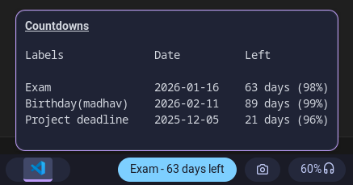
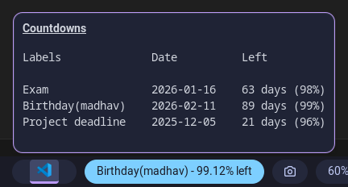
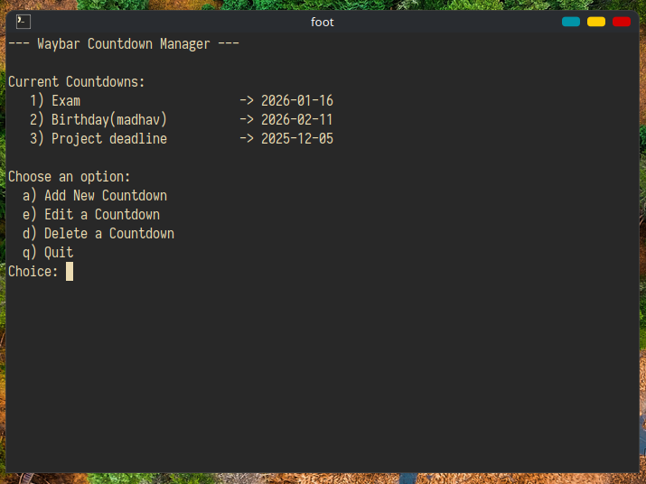

## Waybar Countdown
A lightweight Bash script that provides countdowns (for days) for Waybar. A terminal-based UI for (add/edit/delete) of `target dates`, and allows switching between multiple countdowns using mouse scroll.

## Features

- Store multiple countdowns  
- Interactive menu for adding, editing and deleting countdowns
- Mouse scroll switches between configured countdowns
- Shows countdown in `days left` or `X% left` (configurable)

## Preview

### Waybar Display






### Terminal UI



## Installation 

1. Clone the repository:
```bash
git clone https://github.com/Harsh-bin/waybar-countdown.git
cd waybar-countdown
```

2. Copy the scripts to your Waybar config directory:
```bash
mkdir -p ~/.config/waybar/scripts/countdown
cp countdown.sh ~/.config/waybar/scripts/countdown/
chmod +x ~/.config/waybar/scripts/countdown/*.sh
```

> [!CAUTION]
> The bash script is configured to use `$HOME/.config/waybar/scripts/countdown/` (as the DATA_FILE and STATE_FILE variable). So, you can use the suggested installation step or modify it as needed.

3. Add the module to your Waybar configuration: 
```json
	"custom/countdown":
	{
		  "exec": "~/.config/waybar/scripts/countdown/countdown.sh",
		  "return-type": "json",
		  "format": "{}",
		  "interval": 3600,
		  "on-click-right": "foot bash ~/.config/waybar/scripts/countdown/countdown.sh interactive",
		  "on-scroll-up": "~/.config/waybar/scripts/countdown/countdown.sh scroll-up",
		  "on-scroll-down": "~/.config/waybar/scripts/countdown/countdown.sh scroll-down"
	},
```

Replace `foot bash` with your preferred terminal if needed.

## Usage if you use my `configuration`.

- **Right Click**: Open the interactive TUI
- **Scroll wheel**: To change the countdown displaying on bar


## Author ✍️

Created by [Harsh-bin](https://github.com/Harsh-bin)

---

**Enjoy! 🎉**


